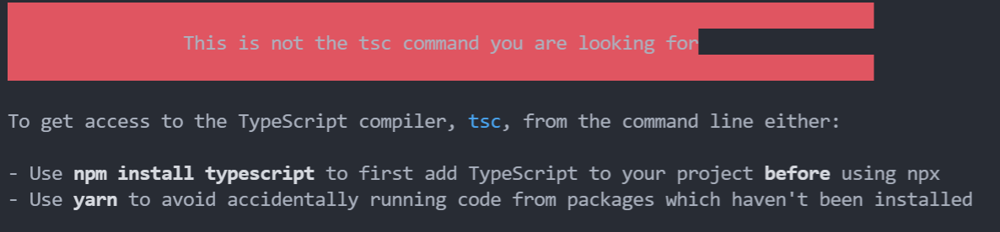

#  NestJS를 위한 express 핵심 원리

## 환경 설정

```json
{
  // ....
  "scripts": {
    "build": "tsc",
    "start:dev": "tsc-watch --onSuccess \"node dist/app.js\"",
    "prestart": "npm run build",
    "start": "node dist/app.js",
    "test": "echo \"Error: no test specified\" && exit 1"
  },
  // ....
}
```

- `yarn start:dev` : tsc-watch 는 타입스크립트 파일 변경 사항을 확인하고 트랜스파일한 뒤 자바스크립트 파일을 실행시킨다  



- 해당 문구가 `tsc` 사용에 발생하여 npm 대신 yarn을 사용하도록 하였다 