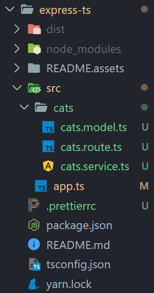

#  NestJS를 위한 express 핵심 원리

## 환경 설정

```json
{
  // ....
  "scripts": {
    "build": "tsc",
    "start:dev": "tsc-watch --onSuccess \"node dist/app.js\"",
    "prestart": "npm run build",
    "start": "node dist/app.js",
    "test": "echo \"Error: no test specified\" && exit 1"
  },
  // ....
}
```

- `yarn start:dev` : tsc-watch 는 타입스크립트 파일 변경 사항을 확인하고 트랜스파일한 뒤 자바스크립트 파일을 실행시킨다  


- 해당 문구가 `tsc` 사용에 발생하여 npm 대신 yarn을 사용하도록 하였다 

## 파일 구조



- `cats.route.ts` : 라우팅, 요청/응답을 담당한단
- `cats.service.ts`: 비즈니스 로직을 처리한다
- `cats.model.ts`: 데이터베이스 데이터에 접근하고 처리한다
- `app.ts`: 서버를 시작한다 

## app.ts 캡슐화

```typescript
class Server {
  public app: express.Application

  constructor() {
    const app = express()
    this.app = app
  }

  private setRouer() {
    app.use('/cats', catRouter)
  }

  private setMiddleware() {
    this.app.use(express.json())

    this.app.use((req: express.Request, res: express.Response, next) => {
      console.log(req.rawHeaders[1])
      next()
    })

    this.setRouer()

    this.app.use((req: express.Request, res: express.Response, next) => {
      console.log(req.rawHeaders[1])
      res.send({ error: '404 not found error' })
    })
  }

  public listen() {
    this.setMiddleware()
    this.app.listen(port, () => {
      console.log(`Start server: http://localhost:${port}`)
    })
  }
}

function init() {
  const server = new Server()
  server.listen()
}

init()
```

